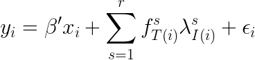

[](https://travis-ci.org/matthieugomez/InteractiveFixedEffectModels.jl)
[](https://coveralls.io/github/matthieugomez/InteractiveFixedEffectModels.jl?branch=master)


## Motivation
This package implements a novel, fast and robust algorithm to estimate interactive fixed effect models. 

The definition of interactive fixed effects follows Bai (2009).Formally, denote `T(i)` and `I(i))` the two categorical dimensions associated with observation `i` (typically time and id).  This package estimates the set of coefficients `β`, of factors `(f1, .., fr)` and of loadings `(λ1, ..., λr)` in the model



```julia
using DataFrames, RDatasets, InteractiveFixedEffectModels
df = dataset("plm", "Cigar")
regife(df, @formula(Sales ~ Price + fe(State) + ife(State, Year, 2)))
#                      Linear Factor Model                      
#================================================================
#Number of obs:             1380  Degree of freedom:          199
#R2:                       0.976  R2 within:                0.435
#Iterations:                 436  Converged:                 true
#================================================================
#        Estimate Std.Error  t value Pr(>|t|) Lower 95% Upper 95%
#----------------------------------------------------------------
#Price  -0.425372 0.0141163 -30.1334    0.000 -0.453068 -0.397677
#================================================================
```


## Syntax
- Formula

	- Interactive fixed effects are indicated with the function  `ife`. For instance, to specify a factor model with id variable `State`, time variable `Year`, and rank 2, use `ife(State, Year, 2)`.

	- High-dimensional Fixed effects can be used, as in `fe(State)` but only for the variables specified in the factor model. See [FixedEffectModels.jl](https://github.com/matthieugomez/FixedEffectModels.jl) for more information

		```julia
		regife(df, @formula(Sales ~ Price +  ife(State, Year, 2)))
		regife(df, @formula(Sales ~ Price +  ife(State, Year, 2) + fe(State)))
		```

	To construct formula programatically, use
	```julia
	regife(df, Term(:Sales) ~ Term(:Price) + ife(Term(:State), Term(:Year), 2) + fe(Term(:State)))
	```
- Standard errors are indicated as follows
	```julia
	Vcov.robust()
	Vcov.cluster(:State)
	Vcov.cluster(:State, :Year)
	```
- The option `weights` can add weights
	```julia
	weights = :Pop
	```
- The option `subset` estimates the model on a subset of the dataframe
	```julia
	subset = df.State .>= 30
	```
	
- The option `method` can be used to choose between two algorithms:
	- `:levenberg_marquardt`
	- `:dogleg` 

- The option `save = true` saves a new dataframe storing residuals, factors, loadings and the eventual fixed effects. Importantly, the returned dataframe is aligned with the initial dataframe (rows not used in the estimation are simply filled with `missing`s).


## FAQ


#### Local minimum vs global minimum
The algorithm can estimate models with missing observations per id x time, multiple observations per id x time, and weights.

However, in these cases, the optimization problem may have local minima. The algorithm tries to catch these cases, and, if need be, restart the optimization until the global minimum is reached. However I am not sure that all the cases are caught. 


#### Does the package estimate PCA / factor models?

Yes. Factor models are a particular case of interactive fixed effect models. 

To estimate a factor model without any demeaning
```julia
using DataFrames, RDatasets, InteractiveFixedEffectModels
df = dataset("plm", "Cigar")
regife(df, @formula(Sales ~ 0 + ife(State, Year, 2)), save = true)
```

To demean with respect to one dimension, use 
```julia
using DataFrames, RDatasets, InteractiveFixedEffectModels
df = dataset("plm", "Cigar")
regife(df, @formula(Sales ~ ife(State, Year, 2) + fe(State)), save = true)
```

The algorithm used in this package allows one to estimate models with multiple (or missing) observations per id x time.

#### When should one use interactive fixed effects models?
Some litterature using this estimation procedure::

- Eberhardt, Helmers, Strauss (2013) *Do spillovers matter when estimating private returns to R&D?*
- Hagedorn, Karahan, Movskii (2015) *Unemployment Benefits and Unemployment in the Great Recession: The Role of Macro Effects*
- Hagedorn, Karahan, Movskii (2015) *The impact of unemployment benefit extensions on employment: the 2014 employment miracle?* 
- Totty (2015) *The Effect of Minimum Wages on Employment: A Factor Model Approach*

#### How are standard errors computed?
Errors are obtained by regressing y on x and covariates of the form `i.id#c.year` and `i.year#c.id`. This way of computing standard errors is hinted in section 6 of of Bai (2009).

#### Does this command implement the bias correction term in Bai (2009)?
In presence of cross or time correlation beyond the factor structure, the estimate for beta is consistent but biased (see Theorem 3 in Bai 2009, which derives the correction term in special cases). However, this package does not implement any correction. You may want to check that your residuals are approximately i.i.d (in which case there is no need for bias correction).


## Related Packages
- https://github.com/joidegn/FactorModels.jl : fits and predict factor models on matrices
- https://github.com/madeleineudell/LowRankModels.jl : fits general low rank approximations on matrices
- https://github.com/aaw/IncrementalSVD.jl: implementation of the backpropagation algorithm

## Install

```julia
using Pkg
Pkg.add("InteractiveFixedEffectModels")
```
